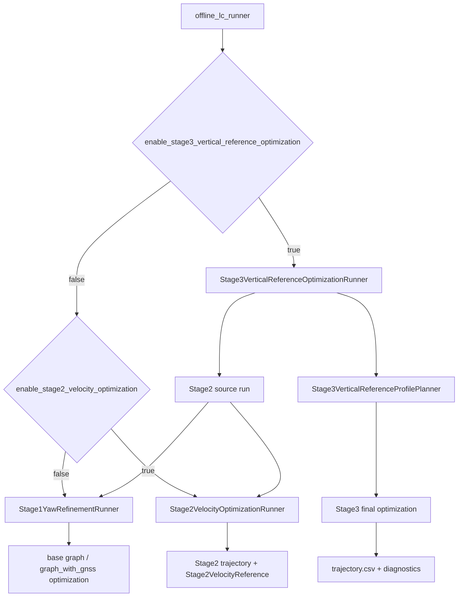
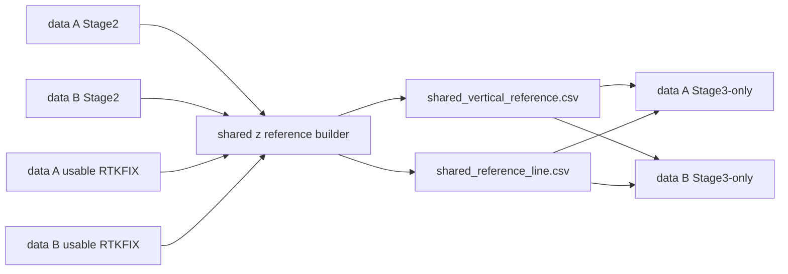

# Stage1-Stage3 规范流程与模块清单

本文档面向当前 `offline_lc_minimal` 主线版本，整理从 Stage1 到 Stage3 的标准运行流程、模块职责、默认参数和启用状态。

## 适用范围

- 系统默认参数以 [config/default_offline.cfg](../config/default_offline.cfg) 为准。
- `src/common/Config.cpp` 中的 `DefaultConfig()` 是代码层面的兜底默认值；正式运行、release 和数据验证默认使用 `config/default_offline.cfg`。
- 默认主入口是 `offline_lc_runner`。共享高程重构后的两步外部流程额外使用：
  - `offline_lc_shared_vertical_reference_builder`
  - `offline_lc_stage3_runner`
- 姿态内部参考应使用 `gtsam::Rot3` / SO(3) 表达；CSV 中的 yaw/pitch/roll 仅作为输出和诊断字段，不作为跨 stage 的内部姿态真值。

## 总体流程

默认 `offline_lc_runner` 采用递归式 stage 调度。用户在配置中打开 Stage3 时，最外层先进入 Stage3 runner；Stage3 runner 内部先生成 Stage2 结果，再基于 Stage2 生成高程参考并执行 Stage3 高程优化。



共享高程参考的外部流程是三步式：每组数据先独立跑到 Stage2，再用两组 Stage2 与 RTK 生成同一个 `z_shared(s)`，最后每组使用同一条共享高程参考跑 Stage3-only。



## Stage1 规范流程

Stage1 的目标是得到稳定的水平轨迹、速度、bias 和姿态初值，特别是修正初始 yaw，使优化后的 GNSS 航迹方向与 RTKFIX 航迹方向一致。Stage1 不应把未收敛的错误姿态分支传递给后续 stage。

### Stage1 输入

- 原始文本数据：
  - GNSS/RTK 观测。
  - IMU 观测。
  - 可选 DMI/里程相关观测。
- `config/default_offline.cfg`。
- 起始地理原点和导航起止时间。

### Stage1 步骤

1. `OfflineBatchRunner::Run()` 根据配置进入 Stage1 yaw refinement。
2. `TextDatasetLoader` 读取原始数据。
3. `GraphTimelineBuilder` 建立统一状态时间线。
4. `TrajectoryInitializer` 生成初始轨迹、速度、bias 和姿态初值。
5. 构建 `base_graph`：
   - IMU 预积分因子。
   - 初始静止/动态静止约束。
   - bias 先验和 bias 演化约束。
   - 必要的基础运动一致性约束。
6. 先优化 `base_graph`，得到 `base_graph_optimized_reference_states`。
7. 基于 `base_graph` 和 GNSS 构建 `graph_with_gnss`。
8. `Stage1YawRefinementRunner` 迭代修正初始 yaw：
   - 使用 `RtkHeadingAlignmentEstimator` 比较优化轨迹航向和 RTKFIX 航向。
   - 每轮修改初始 yaw 后重新优化。
   - 如果在最大迭代次数内收敛，则输出有效 Stage1 结果。
9. 如果 Stage1 yaw refinement 未收敛：
   - `Stage1YawBranchResolver` 检测 90 度/180 度级别的双解振荡。
   - 优先选择姿态连续、接近 IMU 传播、且与 RTKFIX 航迹方向一致的分支。
   - 如果无法唯一判定，则标记 Stage1 参考无效，不允许把最后一次非收敛结果当作有效参考传下去。
10. 输出 Stage1 轨迹和诊断。

### Stage1 默认状态

| 项目 | 默认值 | 是否启用 | 说明 |
| --- | ---: | --- | --- |
| `enable_stage1_yaw_refinement` | `true` | 启用 | Stage1 默认执行 yaw refinement。 |
| `stage1_yaw_refinement_max_iterations` | `10` | 启用 | 最大 yaw refinement 轮数。 |
| `stage1_heading_window_s` | `1` | 启用 | RTK 航向估计窗口。 |
| `stage1_heading_time_tolerance_s` | `0.12` | 启用 | 轨迹和 RTK 匹配时间容差。 |
| `stage1_heading_min_displacement_m` | `0.2` | 启用 | 航向估计最小位移。 |
| `stage1_heading_noise_floor_rad` | `0.00872665` | 启用 | 航向估计噪声下限，约 0.5 deg。 |
| `stage1_yaw_update_max_rad` | `1.5708` | 启用 | 单轮最大 yaw 更新，约 90 deg。 |
| `enable_stage1_outage_body_y_envelope` | `true` | 条件启用 | Stage2 source run 中可用于生成 outage body-y envelope。 |
| `stage1_outage_body_y_pre_window_s` | `60` | 条件启用 | outage 前 body-y 统计窗口。 |
| `stage1_outage_body_y_deadband_rmse_multiplier` | `2` | 条件启用 | 用 RMSE 推导 body-y deadband 的倍数。 |
| `stage1_outage_body_y_min_sample_count` | `100` | 条件启用 | body-y envelope 最少样本数。 |
| `stage1_outage_body_y_min_speed_mps` | `0.5` | 条件启用 | body-y 统计最小车速。 |
| `stage1_outage_body_y_min_sigma_mps` | `0.01` | 条件启用 | body-y envelope 最小 sigma。 |
| `stage1_outage_body_y_max_sigma_mps` | `0.08` | 条件启用 | body-y envelope 最大 sigma。 |
| `stage1_outage_body_y_huber_k` | `1.345` | 条件启用 | body-y robust 估计 Huber 系数。 |

Stage1 残差贡献 CSV 由 `ResidualContributionAnalyzer` 生成；当前代码没有单独的配置开关。

## Stage2 规范流程

Stage2 的目标是在 Stage1 的姿态、位置、速度基础上进一步稳定速度和垂向运动，并为 Stage3 生成可信的 `Stage2VelocityReference`。Stage2 仍可使用 RTK outage 分段 batch 处理，但 Stage2 自身不是最终共享高程一致性的出口。

### Stage2 输入

- Stage1 结果。
- Stage1 的 rotation-native reference states。
- 原始 IMU/GNSS 数据。
- RTK outage window 规划结果。

### Stage2 步骤

1. `Stage2VelocityOptimizationRunner` 先调用 Stage1 source run。
2. `Stage1SourceReferencePolicy` 检查 Stage1 source 是否安全：
   - 如果配置请求了 `rtk_outage_segmented_batch`，则不允许 Stage1 source 被错误降级成没有分段 outage 的参考。
3. 如果启用 outage body-y envelope：
   - `Stage1OutageBodyYEnvelopeEstimator` 从 Stage1 估计 outage 内 body-y envelope。
   - 如果 envelope 有效，则使用约束后的 Stage1 结果生成 Stage2 source。
4. `Stage2VelocityReference` 从 Stage1/Stage2 source trajectory 构建 rotation-native 参考状态。
5. `ApplyStage2ReferenceTrajectoryToInitialValues` 使用 `Rot3` 参考状态写入初值，避免从欧拉角重建姿态。
6. `MakeStage2VelocityOptimizationConfig()` 生成 Stage2 优化配置：
   - 禁止重复递归 Stage1。
   - 禁止部分会拉偏姿态或垂向的非 Stage2 目标。
   - 保留 Stage2 车辆约束、IMU、GNSS、RTK outage 相关处理。
7. 如果启用 `enable_rtk_outage_segmented_batch` 且存在 outage window：
   - 使用 `RtkOutageSegmentedBatchRunner` 分段优化。
   - pre/outage/post 结果再拼接。
8. 输出 Stage2 轨迹、Stage2 reference、outage 诊断、姿态诊断、残差贡献。

### Stage2 默认状态

| 项目 | 默认值 | 是否启用 | 说明 |
| --- | ---: | --- | --- |
| `enable_stage2_velocity_optimization` | `true` | 启用 | Stage2 默认作为 Stage3 source 或单独输出。 |
| `stage2_attitude_hold_sigma_rad` | `1e-05` | Stage3 有 Stage2 ref 时启用 | Stage2 姿态 hold sigma。 |
| `stage2_horizontal_position_hold_sigma_m` | `0.0001` | Stage3 有 Stage2 ref 时启用 | Stage2 水平位置 hold sigma。 |
| `stage2_horizontal_velocity_hold_sigma_mps` | `0.0001` | Stage3 有 Stage2 ref 时启用 | Stage2 水平速度 hold sigma。 |
| `stage2_mount_leakage_prior_sigma_rad` | `0.02` | Stage2 vehicle NHC 启用 | Stage2 安装泄漏参数先验 sigma。 |
| `enable_stage2_vehicle_nhc_constraint` | `true` | Stage2 source 启用 | Stage2 车辆坐标系 NHC。 |
| `stage2_vehicle_y_nhc_velocity_sigma_mps` | `0.05` | 条件启用 | 车辆 y 向速度约束。 |
| `stage2_vehicle_y_nhc_displacement_sigma_m` | `0.05` | 条件启用 | 车辆 y 向位移约束。 |
| `stage3_disable_stage2_vehicle_nhc_constraint` | `true` | Stage3 包装开关 | 基础配置请求 Stage3 final 关闭 vehicle NHC；子配置会清除该包装开关并直接令 `enable_stage2_vehicle_nhc_constraint=false`。 |
| `enable_stage2_lowfreq_vertical_reference_optimization` | `false` | 默认关闭 | 旧低频垂向参考 Stage2 流程。 |

## Stage3 规范流程

当前 Stage3 的目标是：在 Stage2 已有姿态、水平位置、水平速度和 bias 基础上，只对高程相关状态进行进一步优化。Stage3 的垂向目标来自低频/平滑高程参考，且保留 IMU、vertical jump、vertical bias 框架。Stage3 不应重新解释水平轨迹或姿态。

### Stage3 内嵌流程

默认 `offline_lc_runner` 打开 `enable_stage3_vertical_reference_optimization=true` 时，执行内嵌 Stage3：

1. `Stage3VerticalReferenceOptimizationRunner` 先生成 Stage2 source。
2. `Stage3VerticalReferenceProfilePlanner` 从 Stage2 轨迹生成 Stage3 高程参考。
3. `MakeStage3HeightOptimizationConfig()` 生成 Stage3 final 配置：
   - 关闭 raw GNSS 水平/垂向因子。
   - 关闭 RTK drift/outage 垂向参考递归。
   - 关闭 late-static、initial-static RTK height、initial-dynamic-static 等 raw RTK 垂向拉拽。
   - 关闭会竞争 Stage2 姿态/水平 hold 的姿态和 NHC 约束。
   - 强制 Stage3 vertical reference 使用 5 mm envelope gate、3 mm sigma，并关闭 center-pull。
   - 保留 Stage2 姿态、水平位置、水平速度 hold。
   - 保留 Stage3 vertical reference、vertical jump/bias、IMU 垂向相关约束。
4. `OfflineBatchRunner` 在 active Stage3 reference 存在时：
   - 初值继承 Stage2 reference。
   - GNSS builder 设置 `disable_horizontal_factors=true` 和 `disable_vertical_factors=true`。
   - 添加 `Stage3VerticalReferenceConstraintBuilder`。
   - 调用 `Stage3JumpRegularizerConstraintBuilder`，但 v2.3 final 默认关闭旧 jump regularizer。
   - 添加 Stage3-Stage2 垂向增量继承和 jump-shape 继承约束。
   - 添加 Stage2 姿态/水平位置/水平速度 hold。
5. 输出 Stage3 轨迹和垂向诊断。

### Stage3-only 共享高程流程

Stage3-only 外部入口用于两组或多组数据共享同一条距离域高程参考：

1. 每组数据独立运行到 Stage2。
2. `offline_lc_shared_vertical_reference_builder` 读取两组 Stage2 trajectory 和可用 RTKFIX，生成：
   - `shared_vertical_reference.csv`
   - `shared_reference_line.csv`
   - `shared_vertical_reference_projection_diagnostics.csv`
3. `offline_lc_stage3_runner` 对每组数据分别读取：
   - 本组 Stage2 trajectory。
   - 同一个 `shared_vertical_reference.csv`。
   - 同一个 `shared_reference_line.csv`。
4. `Stage3SharedReferenceMapper` 将本组 Stage2 状态投影到共享参考线，插值得到 per-state Stage3 vertical reference。
5. Stage3-only 只运行 Stage3 final，不重跑 Stage1/Stage2。

### Stage3 默认状态

| 项目 | 默认值 | 是否启用 | 说明 |
| --- | ---: | --- | --- |
| `enable_stage3_vertical_reference_optimization` | `true` | 启用 | 默认主入口执行 Stage3。 |
| `stage3_vertical_reference_smoothing_method` | `spline_baseline` | 启用 | Stage3 内嵌参考平滑方法。 |
| `stage3_vertical_reference_lowpass_cutoff_hz` | `0.01` | fallback | 低通 fallback 截止频率。 |
| `stage3_vertical_reference_spline_knot_spacing_m` | `1` | 启用 | spline knot 距离间隔。 |
| `stage3_vertical_reference_spline_smooth_lambda` | `10000` | 启用 | spline 平滑项权重。 |
| `stage3_vertical_reference_spline_anchor_weight` | `100000` | 启用 | spline anchor 权重。 |
| `stage3_vertical_reference_spline_slope_weight` | `1000` | 启用 | slope 平滑权重。 |
| `stage3_vertical_anchor_sigma_m` | `0.001` | fallback | 共享参考 sigma 缺失时的 fallback，兼容 Gaussian 路径。 |
| `stage3_vertical_reference_constraint_mode` | `envelope` | Stage3 final 强制 | `MakeStage3HeightOptimizationConfig()` 将 final pass 从基础 cfg 的 Gaussian 收窄为 envelope gate。 |
| `stage3_vertical_envelope_half_width_m` | `0.005` | Stage3 final 强制 | 当前 tuned Stage3 高程 envelope 半宽。 |
| `stage3_vertical_envelope_sigma_m` | `0.003` | Stage3 final 强制 | 当前 tuned Stage3 高程 envelope sigma。 |
| `enable_stage3_vertical_envelope_center_pull` | `false` | Stage3 final 强制 | 关闭 center-pull，避免单组 Stage3 被额外拉出 Stage2 短波形状。 |
| `enable_stage3_stage2_vertical_increment_hold` | `true` | 启用 | 保持 `Stage3 - Stage2` 的相邻差值低频化，抑制 IRI 短波毛刺。 |
| `stage3_stage2_vertical_increment_sigma_m` | `0.0002` | 启用 | 非 jump 区 Stage2 垂向增量继承 sigma。 |
| `stage3_stage2_vertical_increment_jump_sigma_m` | `0.0005` | 启用 | jump 区 Stage2 垂向增量继承 sigma。 |
| `enable_stage3_stage2_jump_shape_hold` | `true` | 启用 | jump 窗口内继承 Stage2 相对高程形状。 |
| `stage3_stage2_jump_shape_sigma_m` | `0.0005` | 启用 | jump shape hold sigma。 |
| `enable_stage3_jump_velocity_smoothness_regularizer` | `false` | 关闭 | 旧 Stage3 jump 速度正则默认关闭，避免和 Stage2 形状继承重复。 |
| `stage3_jump_velocity_smoothness_sigma_mps` | `0.005` | 关闭 | 旧 jump 速度平滑 sigma，仅保留为兼容参数。 |
| `enable_stage3_jump_height_highfreq_deadband` | `false` | 关闭 | 旧 jump 高频高度 deadband 默认关闭，改由 Stage2 increment/jump-shape 继承抑制毛刺。 |
| `stage3_jump_height_highfreq_deadband_m` | `0.00085` | 关闭 | 旧 jump 高频 deadband，仅保留为兼容参数。 |
| `stage3_jump_height_highfreq_sigma_m` | `0.0012` | 关闭 | 旧 jump 高频约束 sigma，仅保留为兼容参数。 |
| `enable_stage3_jump_adaptive_context_envelope` | `false` | 默认关闭 | 自适应上下文 envelope。 |
| `enable_stage3_vertical_reference_terminal_static_exclusion` | 代码默认 `true` | 启用 | 末端静止段可从参考构造中排除。 |

## 共享高程参考默认状态

共享高程参考模块不由 `config/default_offline.cfg` 直接触发，而是通过独立 CLI 运行。

| 项目 | 默认值 | 是否启用 | 说明 |
| --- | ---: | --- | --- |
| `offline_lc_shared_vertical_reference_builder` | 独立工具 | 手动启用 | 从 manifest 生成共享距离域高程参考。 |
| `--grid-spacing-m` | `1.0` | CLI 默认 | `z_shared(s)` 采样间隔。 |
| `--sigma-m` | `0.015` | CLI 默认 | 输出共享参考默认 sigma。 |
| RTK offset smoothing radius | `12.0 m` | 启用 | 稳定 RTK 段 offset 平滑半径。 |
| RTK robust Huber scale | `0.015 m` | 启用 | RTK offset robust 平滑尺度。 |
| final reference smoothing radius | `4.0 m` | 启用 | 最终共享参考平滑半径。 |
| reference line source | 最长有效 Stage2 轨迹 | 启用 | 统一距离轴 `s_m` 的参考线。 |
| outage / recovery bridge | Stage2 nav bridge 去偏 | 启用 | RTK 不可信或稀疏区使用导航 bridge。 |

## 关键默认参数总览

### 输入、输出和调试

| 参数 | 默认值 | 是否启用 | 说明 |
| --- | ---: | --- | --- |
| `write_debug_csv` | `true` | 启用 | 输出调试 CSV。 |
| `enable_stage_attitude_debug_export` | `true` | 启用 | 保存 stage 姿态 debug 轨迹。 |
| `write_error_diagnostics` | `false` | 默认关闭 | 输出误差状态诊断。 |
| `write_segment_error_diagnostics` | `true` | 启用 | 输出分段误差诊断。 |
| `write_imu_rate_avp` | `false` | 默认关闭 | 输出 IMU-rate AVP 轨迹。 |
| `state_frequency_hz` | `20` | 启用 | 默认优化状态频率。 |
| `processing_start_time_s` | `0` | 未限制 | `0` 表示使用数据起点。 |
| `processing_end_time_s` | `0` | 未限制 | `0` 表示使用数据终点。 |

### GNSS / RTK 策略

| 参数 | 默认值 | 是否启用 | 说明 |
| --- | ---: | --- | --- |
| `drop_non_rtkfix` | `true` | 启用 | 非 RTKFIX 默认不参与普通 GNSS 因子。 |
| `required_best_sol_status_code` | `1` | 启用 | 默认要求 best solution status 为 FIX。 |
| `drop_no_solution` | `true` | 启用 | `NO_SOLUTION` 默认剔除。 |
| `gnss_position_noise_model` | `huber` | 启用 | 普通 GNSS 位置因子 robust noise model。 |
| `gnss_position_robust_param` | `0.5` | 启用 | GNSS Huber 参数。 |
| `enable_gnss_preoutage_quality_override` | `true` | 启用 | outage 前非 FIX 质量覆盖策略。 |
| `enable_rtk_valid_horizontal_velocity_delta_constraint` | `true` | 启用 | RTK 有效段水平速度 delta 约束。 |
| `enable_rtk_velocity_constraint` | `false` | 默认关闭 | 旧 RTK velocity window 约束默认关闭。 |
| `enable_rtk_outage_smoothing` | `true` | 启用 | RTK outage 平滑/分段相关功能可用。 |
| `enable_rtk_outage_segmented_batch` | `true` | 启用 | outage 默认使用 segmented batch。 |
| `rtk_outage_min_gap_s` | `2` | 启用 | RTK outage 合并/识别最小 gap。 |
| `rtk_outage_recovery_reference_min_fix_samples` | `5` | 启用 | 恢复段参考最少 FIX 样本数。 |

### 姿态参考

| 参数 | 默认值 | 是否启用 | 说明 |
| --- | ---: | --- | --- |
| `enable_attitude_reference_constraint` | `true` | 默认启用，Stage2/Stage3 policy 可关闭 | 普通姿态参考约束入口。 |
| `attitude_reference_sigma_rad` | `0.01` | 条件启用 | roll/pitch 参考 sigma。 |
| `attitude_reference_relative_yaw_sigma_rad` | `0.001` | 条件启用 | 相对 yaw sigma。 |
| `enable_base_graph_tilt_reference_constraint` | `true` | 默认启用 | 使用 base_graph_optimized 的 tilt 参考。 |
| `base_graph_tilt_reference_sigma_rad` | `0.003` | 条件启用 | base tilt sigma。 |
| `rtk_outage_relative_attitude_sigma_rad` | `0.001` | 条件启用 | outage 相对姿态 sigma。 |

### IMU / bias

| 参数 | 默认值 | 是否启用 | 说明 |
| --- | ---: | --- | --- |
| `imu_sigma_acc_ug` | `2039.4324259558564` | 启用 | IMU 加速度噪声，配置单位为 ug。 |
| `imu_sigma_gyro_dph` | `412.52961249419275` | 启用 | IMU 陀螺噪声，配置单位为 deg/h。 |
| `bias_acc_sigma_ug` | `0.50985810648896412` | 启用 | 加计 bias random-walk sigma。 |
| `bias_gyro_sigma_dph` | `2.0626480624709638` | 启用 | 陀螺 bias random-walk sigma。 |
| `bias_acc_prior_sigma_ug` | `1019.7162129779282` | 启用 | 加计 bias 先验 sigma。 |
| `bias_gyro_prior_sigma_dph` | `0.01` | 启用 | 陀螺 bias 先验 sigma。 |
| `enable_vertical_acc_bias_gm_process` | `true` | 启用 | 垂向加计 bias GM 过程。 |
| `vertical_acc_bias_tau_s` | `100` | 启用 | GM 时间常数。 |
| `vertical_acc_bias_sigma_ug` | `0.1` | 启用 | GM sigma。 |
| `vertical_acc_bias_process_noise_scale` | `1` | 启用 | GM 过程噪声缩放。 |

### 垂向运动和 jump

| 参数 | 默认值 | 是否启用 | 说明 |
| --- | ---: | --- | --- |
| `enable_vertical_velocity_delta_constraint` | `true` | 启用 | 垂向速度 delta 约束。 |
| `vertical_velocity_delta_acc_sigma_ug` | `10197.162129779283` | 启用 | 垂向速度 delta 目标加速度 sigma。 |
| `vertical_velocity_delta_min_sigma_mps` | `0.003` | 启用 | 垂向速度 delta 最小 sigma。 |
| `enable_vertical_velocity_delta_context_sigma_scale` | `true` | 启用 | 按 road/jump/outage 上下文缩放 sigma。 |
| `vertical_velocity_delta_context_normal_sigma_scale` | `100` | 启用 | 普通段 sigma 缩放。 |
| `vertical_velocity_delta_context_rough_sigma_scale` | `1000` | 启用 | rough-road 段 sigma 缩放。 |
| `vertical_velocity_delta_context_outage_sigma_scale` | `100` | 启用 | outage 段 sigma 缩放。 |
| `vertical_velocity_delta_context_jump_sigma_scale` | `100` | 启用 | jump 段 sigma 缩放。 |
| `vertical_constraint_mode` | `envelope` | 启用 | 普通 GNSS 垂向使用 envelope 约束。 |
| `vertical_envelope_gate_sigma_multiple` | `1` | 启用 | envelope gate 倍数。 |
| `vertical_envelope_factor_sigma_m` | `0.01` | 启用 | envelope factor sigma。 |
| `enable_vertical_envelope_center_pull` | `true` | Stage1/2 启用 | 普通 GNSS envelope center-pull；Stage3 final 关闭竞争项。 |
| `enable_vertical_motion_adaptive_reweighting` | `true` | 启用 | 垂向运动自适应重加权。 |
| `enable_vertical_jump_impulse` | `false` | 默认关闭 | jump impulse 路径。 |
| `enable_vertical_jump_bias` | `true` | 启用 | jump bias 路径。 |
| `vertical_jump_bias_prior_sigma_ug` | `5098.5810648896413` | 启用 | jump bias prior sigma。 |
| `vertical_jump_bias_velocity_sigma_mps` | `0.01` | 启用 | jump bias velocity sigma。 |

### Body-Z / NHC

| 参数 | 默认值 | 是否启用 | 说明 |
| --- | ---: | --- | --- |
| `enable_body_z_nhc_constraint` | `true` | 默认启用，Stage3 final 关闭 | body-z NHC 主开关。 |
| `enable_body_z_nhc_global_weak_constraint` | `true` | 默认启用，Stage3 final 关闭 | 全局弱 body-z NHC。 |
| `enable_body_z_nhc_strict_effective_weighting` | `true` | 默认启用，Stage3 final 关闭 | 严格有效权重。 |
| `body_z_nhc_jump_padding_s` | `0.6` | 条件启用 | jump 附近 body-z NHC padding。 |
| `body_z_nhc_global_velocity_sigma_mps` | `0.005` | 条件启用 | 全局 body-z NHC 速度 sigma。 |
| `body_z_nhc_global_displacement_sigma_m` | `0.005` | 条件启用 | 全局 body-z NHC 位移 sigma。 |
| `enable_body_z_nhc_horizontal_leakage_correction` | `true` | 默认启用，Stage3 final 关闭 | 水平泄漏修正。 |
| `enable_road_noise_state_baz_reestimate` | `true` | 启用 | road-noise state 触发 `ba_z` 局部重估。 |
| `road_noise_state_window_s` | `3` | 启用 | road-noise state 估计窗口。 |
| `road_noise_state_min_segment_s` | `10` | 启用 | road-noise state 最短重估段。 |

## 模块清单

下面按职责列出主要模块、功能、默认启用状态和关键参数。这里的“启用状态”指默认主流程或对应 CLI 下的实际状态；部分模块虽然编译存在，但只在特定配置或外部工具中启用。

### 入口与调度

| 模块 | 位置 | 功能 | 默认状态 |
| --- | --- | --- | --- |
| `offline_lc_runner` | `src/offline_runner/main.cpp` | 默认完整运行入口，读取配置和数据并调用 `OfflineBatchRunner`。 | 启用 |
| `OfflineBatchRunner` | `src/core/OfflineBatchRunner.cpp` | 核心图构建、stage 调度、优化执行和结果组装。 | 启用 |
| `offline_lc_stage3_runner` | `src/stage3_runner/main.cpp` | Stage3-only 外部入口，读取 Stage2 trajectory 和共享高程参考。 | 手动启用 |
| `offline_lc_shared_vertical_reference_builder` | `src/shared_vertical_reference_builder/main.cpp` | 生成共享 `z_shared(s)` 和参考线。 | 手动启用 |
| `OptimizationStagePolicy` | `src/core/OptimizationStagePolicy.cpp` | 生成 Stage1/Stage2 的递归配置，防止 stage 内重复进入自身。 | 启用 |
| `Stage3HeightOptimizationPolicy` | `src/core/Stage3HeightOptimizationPolicy.cpp` | 生成 Stage3 source/final 配置，关闭竞争性 GNSS/RTK/姿态模块。 | 启用 |

### 配置、数据类型和输出

| 模块 | 位置 | 功能 | 默认状态 |
| --- | --- | --- | --- |
| `Config` | `src/common/Config.cpp` | 参数结构、默认值、配置文件解析、snapshot 输出。 | 启用 |
| `OfflineRunnerConfig` | `include/offline_lc_minimal/common/Config.h` | 全局配置结构。 | 启用 |
| `RunResultTypes` | `include/offline_lc_minimal/common/RunResultTypes.h` | stage 结果、轨迹行、诊断结构。 | 启用 |
| `ResultWriter` | `src/common/ResultWriter.cpp` | 写出 `trajectory.csv`、`summary.txt` 和各类诊断。 | 启用 |
| `ResultOutputWriters` | `src/common/ResultOutputWriters.cpp` | 具体 CSV writer。 | 启用 |
| `RunDiagnosticsBuilder` | `src/core/RunDiagnosticsBuilder.cpp` | 汇总运行统计和诊断输出。 | 启用 |

### 数据读取和轨迹 CSV

| 模块 | 位置 | 功能 | 默认状态 |
| --- | --- | --- | --- |
| `TextDatasetLoader` | `src/io/TextDatasetLoader.cpp` | 读取原始 GNSS/IMU 文本数据并生成 `DataSummary`。 | 启用 |
| `TrajectoryCsvReader` | `src/io/TrajectoryCsvReader.cpp` | 读取已有 `trajectory.csv`，用于 Stage3-only。 | Stage3-only 启用 |
| `DataSummary` | `include/offline_lc_minimal/common/SensorTypes.h` | 数据统计结构，写入 `data_summary.txt`。 | 启用 |

### 时间线、初始化和 IMU

| 模块 | 位置 | 功能 | 默认状态 |
| --- | --- | --- | --- |
| `GraphTimelineBuilder` | `src/core/GraphTimelineBuilder.cpp` | 建立优化状态时间线。 | 启用 |
| `TrajectoryInitializer` | `src/core/TrajectoryInitializer.cpp` | 生成初始位置、速度、姿态和 bias。 | 启用 |
| `StaticImuAlignment` | `src/core/StaticImuAlignment.cpp` | 静止 IMU 初始姿态对准。 | 条件启用 |
| `ImuIntegrationUtils` | `src/core/ImuIntegrationUtils.cpp` | IMU 窗口积分和相对姿态/速度传播工具。 | 启用 |
| `TrajectoryResultBuilder` | `src/core/TrajectoryResultBuilder.cpp` | 从优化 values 构造 `TrajectoryRow`。 | 启用 |
| `ImuRateAvpReconstructor` | `src/core/ImuRateAvpReconstructor.cpp` | 重建 IMU-rate AVP 诊断轨迹。 | 条件启用 |

### GNSS / RTK

| 模块 | 位置 | 功能 | 默认状态 |
| --- | --- | --- | --- |
| `GnssFactorBuilder` | `src/core/GnssFactorBuilder.cpp` | 构建 GNSS 位置/速度/垂向因子；Stage3 有 reference 时关闭 raw GNSS。 | Stage1/2 启用，Stage3 final 关闭 raw GNSS |
| `GnssPreOutageQualityOverride` | `src/core/GnssPreOutageQualityOverride.cpp` | outage 前 GNSS 质量覆盖策略。 | 条件启用 |
| `GnssVerticalReferenceSelector` | `src/core/GnssVerticalReferenceSelector.cpp` | 选择可用于垂向参考的 GNSS 点。 | 条件启用 |
| `GPWNOJInterpolator` | `include/offline_lc_minimal/gp/GPWNOJInterpolator.h` | GP 插值辅助。 | 条件启用 |
| `RtkHeadingAlignmentEstimator` | `src/core/RtkHeadingAlignmentEstimator.cpp` | 用 RTKFIX 航迹估计 Stage1 yaw 误差。 | Stage1 启用 |
| `RtkVelocityConstraintBuilder` | `src/core/RtkVelocityConstraintBuilder.cpp` | RTK 速度约束。 | 条件启用 |

### Stage1 模块

| 模块 | 位置 | 功能 | 默认状态 |
| --- | --- | --- | --- |
| `Stage1YawRefinementRunner` | `src/core/Stage1YawRefinementRunner.cpp` | Stage1 yaw refinement 主流程。 | 启用 |
| `Stage1YawBranchResolver` | `src/core/Stage1YawBranchResolver.cpp` | 检测并处理 yaw 双解/振荡。 | 未收敛时启用 |
| `Stage1SourceReferencePolicy` | `src/core/Stage1SourceReferencePolicy.cpp` | 检查 Stage1 source 是否安全可传递。 | Stage2 source 启用 |
| `Stage1OutageLateralVelocityEnvelopeEstimator` | `src/core/Stage1OutageLateralVelocityEnvelopeEstimator.cpp` | 估计 outage body-y envelope。 | 条件启用 |
| `Stage1OutageBodyYEnvelopeConstraintBuilder` | `src/core/Stage1OutageBodyYEnvelopeConstraintBuilder.cpp` | 构造 body-y envelope 约束。 | 条件启用 |
| `ResidualContributionAnalyzer` | `src/core/ResidualContributionAnalyzer.cpp` | 分析 Stage1 残差贡献。 | 启用 |

### Stage2 模块

| 模块 | 位置 | 功能 | 默认状态 |
| --- | --- | --- | --- |
| `Stage2VelocityOptimizationRunner` | `src/core/Stage2VelocityOptimizationRunner.cpp` | Stage2 主流程，基于 Stage1 source 生成并优化 Stage2。 | 启用 |
| `Stage2VelocityReference` | `src/core/Stage2VelocityReference.cpp` | 保存 rotation-native Stage2 reference states，并插值给后续 stage。 | 启用 |
| `Stage2AttitudeHoldBuilder` | `src/core/Stage2AttitudeHoldBuilder.cpp` | Stage3 中保持 Stage2 姿态。 | Stage3 final 启用 |
| `Stage2HorizontalHoldBuilder` | `src/core/Stage2HorizontalHoldBuilder.cpp` | Stage3 中保持 Stage2 水平位置和水平速度。 | Stage3 final 启用 |
| `Stage2VehicleNHCConstraintBuilder` | `src/core/Stage2VehicleNHCConstraintBuilder.cpp` | Stage2 车辆坐标系 NHC。 | Stage2 启用，Stage3 final 关闭 |
| `Stage2LowfreqVerticalReferenceOptimizationRunner` | `src/core/Stage2LowfreqVerticalReferenceOptimizationRunner.cpp` | 旧低频垂向 Stage2 流程。 | 默认关闭 |

### Stage3 模块

| 模块 | 位置 | 功能 | 默认状态 |
| --- | --- | --- | --- |
| `Stage3VerticalReferenceOptimizationRunner` | `src/core/Stage3VerticalReferenceOptimizationRunner.cpp` | 内嵌 Stage3 主流程。 | 启用 |
| `Stage3VerticalReferenceProfilePlanner` | `src/core/Stage3VerticalReferenceProfilePlanner.cpp` | 从 Stage2 轨迹规划 Stage3 高程参考。 | 内嵌 Stage3 启用 |
| `Stage3VerticalReferenceSmoother` | `src/core/Stage3VerticalReferenceSmoother.cpp` | lowpass/spline 高程平滑。 | 内嵌 Stage3 启用 |
| `Stage3VerticalReferenceConstraintBuilder` | `src/core/Stage3VerticalReferenceConstraintBuilder.cpp` | 构建 Stage3 高程参考因子。 | Stage3 final 启用 |
| `Stage3JumpRegularizerConstraintBuilder` | `src/core/Stage3JumpRegularizerConstraintBuilder.cpp` | 构建兼容的 jump 区速度/高度正则；v2.3 final 默认关闭这些旧正则。 | 默认关闭 |
| `Stage3Stage2IncrementHoldConstraintBuilder` | `src/core/Stage3Stage2IncrementHoldConstraintBuilder.cpp` | 约束 Stage3 继承 Stage2 相邻垂向增量。 | Stage3 final 启用 |
| `Stage3Stage2JumpShapeHoldConstraintBuilder` | `src/core/Stage3Stage2JumpShapeHoldConstraintBuilder.cpp` | 约束 Stage3 继承 Stage2 jump 相对形状。 | Stage3 final 启用 |
| `Stage3JumpContextEnvelopePlanner` | `src/core/Stage3JumpContextEnvelopePlanner.cpp` | 规划 jump 上下文 envelope。 | 默认关闭 |
| `Stage3VerticalReferenceTimelineAligner` | `src/core/Stage3VerticalReferenceTimelineAligner.cpp` | 将高程参考对齐到优化时间线。 | 条件启用 |
| `Stage3SharedReferenceMapper` | `src/core/Stage3SharedReferenceMapper.cpp` | Stage3-only 中将 Stage2 状态投影到共享参考。 | Stage3-only 启用 |
| `Stage3SharedReferenceDeltaSmoother` | `src/core/Stage3SharedReferenceDeltaSmoother.cpp` | 平滑共享参考相对 Stage2 的 delta。 | Stage3-only 启用 |
| `SharedVerticalReferenceBuilder` | `src/core/SharedVerticalReferenceBuilder.cpp` | 生成统一距离域 `z_shared(s)`。 | 独立工具启用 |

### 姿态参考和姿态调试

| 模块 | 位置 | 功能 | 默认状态 |
| --- | --- | --- | --- |
| `StageAttitudeReference` | `src/core/StageAttitudeReference.cpp` | 保存 `Rot3` 姿态参考，使用 SO(3) 插值和 IMU delta 传播。 | 启用 |
| `AttitudeReferenceConstraintBuilder` | `src/core/AttitudeReferenceConstraintBuilder.cpp` | 构建 base tilt、roll/pitch、yaw 和相对 yaw/姿态约束。 | Stage1/2 条件启用，Stage3 final 关闭竞争项 |
| `StageAttitudeDebug` | `src/core/StageAttitudeDebug.cpp` | 导出 base_graph、body-z seed、stage anchor 等姿态轨迹。 | 启用 |

### RTK outage 分段和恢复

| 模块 | 位置 | 功能 | 默认状态 |
| --- | --- | --- | --- |
| `RtkOutageWindowPlanner` | `src/core/RtkOutageWindowPlanner.cpp` | 检测和规划 RTK outage window。 | 启用 |
| `RtkOutageSegmentedBatchRunner` | `src/core/RtkOutageSegmentedBatchRunner.cpp` | pre/outage/post 分段 batch 优化。 | 启用 |
| `RtkOutageBatchSegmentPlanner` | `src/core/RtkOutageBatchSegmentPlanner.cpp` | 生成分段 batch 的 segment。 | 启用 |
| `RtkOutageBoundaryConstraintBuilder` | `src/core/RtkOutageBoundaryConstraintBuilder.cpp` | 构建 outage 边界位置/速度/bias 约束。 | 启用 |
| `RtkOutageBoundaryInitialValueApplicator` | `src/core/RtkOutageBoundaryInitialValueApplicator.cpp` | 将 outage 边界参考应用到分段初值。 | 启用 |
| `RtkOutageBoundaryAttitudeHandoff` | `src/core/RtkOutageBoundaryAttitudeHandoff.cpp` | 用 outage last + IMU delta 生成 post start 姿态 handoff。 | 条件启用 |
| `RtkOutageRecoveryConstraintBuilder` | `src/core/RtkOutageRecoveryConstraintBuilder.cpp` | 构造 RTK 恢复段位置/速度/姿态恢复约束。 | 条件启用 |
| `RtkOutageSmoothingConstraintBuilder` | `src/core/RtkOutageSmoothingConstraintBuilder.cpp` | outage 平滑约束。 | 条件启用 |
| `RtkOutageCausalReferenceBuilder` | `src/core/RtkOutageCausalReferenceBuilder.cpp` | causal outage 垂向参考生成。 | 条件启用 |
| `RtkOutagePreOutageVerticalFenceBuilder` | `src/core/RtkOutagePreOutageVerticalFenceBuilder.cpp` | outage 前垂向 fence。 | Stage1/2 启用，Stage3 final 关闭 |
| `RtkOutageBiasContinuityPolicy` | `src/core/RtkOutageBiasContinuityPolicy.cpp` | 分段拼接 bias 连续策略。 | 条件启用 |
| `SegmentedBatchResultAssembler` | `src/core/SegmentedBatchResultAssembler.cpp` | 拼接分段 batch 结果。 | 启用 |

### RTK 垂向漂移和低通参考

| 模块 | 位置 | 功能 | 默认状态 |
| --- | --- | --- | --- |
| `RtkVerticalDriftReferenceEstimator` | `src/core/RtkVerticalDriftReferenceEstimator.cpp` | RTK 垂向漂移参考估计。 | Stage1/2 启用，Stage3 final 关闭 |
| `RtkVerticalDriftGateWeighting` | `src/core/RtkVerticalDriftGateWeighting.cpp` | 垂向漂移 gate 权重。 | 条件启用 |
| `RtkVerticalLowpassReferenceFilter` | `src/core/RtkVerticalLowpassReferenceFilter.cpp` | RTK 垂向低通参考。 | 默认关闭 |

### 静止检测

| 模块 | 位置 | 功能 | 默认状态 |
| --- | --- | --- | --- |
| `InitialStaticConstraintBuilder` | `src/core/InitialStaticConstraintBuilder.cpp` | 初始静止 ZUPT/ZARU 和姿态相关约束。 | 条件启用 |
| `InitialStaticBiasConstraintBuilder` | `src/core/InitialStaticBiasConstraintBuilder.cpp` | 初始静止 bias 约束。 | 条件启用 |
| `InitialStaticRtkHeightConstraintBuilder` | `src/core/InitialStaticRtkHeightConstraintBuilder.cpp` | 初始静止 RTK 高程参考。 | Stage3 final 关闭 |
| `InitialDynamicStaticConstraintBuilder` | `src/core/InitialDynamicStaticConstraintBuilder.cpp` | 初始动态静止窗口约束。 | Stage3 final 关闭 |
| `InitialDynamicStaticDetector` | `src/core/InitialDynamicStaticDetector.cpp` | 初始动态静止检测。 | 默认 Stage3 final 关闭 |
| `LateStaticDetector` | `src/core/LateStaticDetector.cpp` | 末端静止检测。 | Stage3 final 关闭 |

### Body-Z 和 NHC

| 模块 | 位置 | 功能 | 默认状态 |
| --- | --- | --- | --- |
| `BodyZWindowPipeline` | `src/core/BodyZWindowPipeline.cpp` | body-z window 生成和处理主流程。 | 条件启用 |
| `BodyZBidirectionalJumpDetector` | `src/core/BodyZBidirectionalJumpDetector.cpp` | 双向 jump 检测。 | 条件启用 |
| `BodyZJumpWindowClassifier` | `src/core/BodyZJumpWindowClassifier.cpp` | body-z jump window 分类。 | 条件启用 |
| `BodyZJumpConstraintWindowPlanner` | `src/core/BodyZJumpConstraintWindowPlanner.cpp` | 规划 body-z jump 约束窗口。 | 条件启用 |
| `BodyZBiasReestimatePlanner` | `src/core/BodyZBiasReestimatePlanner.cpp` | body-z bias 重估规划。 | 条件启用 |
| `BodyZBiasReestimateConstraintBuilder` | `src/core/BodyZBiasReestimateConstraintBuilder.cpp` | body-z bias 重估约束构建。 | 条件启用 |
| `BodyZNHCConstraintBuilder` | `src/core/BodyZNHCConstraintBuilder.cpp` | body-z NHC 因子。 | Stage1/2 条件启用，Stage3 final 关闭 |
| `BodyZNHCWeightPlanner` | `src/core/BodyZNHCWeightPlanner.cpp` | NHC 权重规划。 | 条件启用 |
| `BodyZHorizontalLeakageEstimator` | `src/core/BodyZHorizontalLeakageEstimator.cpp` | body-z 水平泄漏估计。 | Stage1/2 条件启用，Stage3 final 关闭 |

### 垂向约束和 jump

| 模块 | 位置 | 功能 | 默认状态 |
| --- | --- | --- | --- |
| `VerticalConstraintPolicy` | `src/core/VerticalConstraintPolicy.cpp` | 垂向约束启停和组合策略。 | 启用 |
| `VerticalMotionConstraintBuilder` | `src/core/VerticalMotionConstraintBuilder.cpp` | 构建垂向速度/位移相关约束。 | 启用 |
| `VerticalVelocityDeltaConstraintBuilder` | `src/core/VerticalVelocityDeltaConstraintBuilder.cpp` | 垂向速度 delta 约束。 | 启用 |
| `VerticalVelocityDeltaContextScalePlanner` | `src/core/VerticalVelocityDeltaContextScalePlanner.cpp` | 按上下文规划垂向速度 delta sigma 缩放。 | 启用 |
| `VerticalAdaptiveReweightingLoop` | `src/core/VerticalAdaptiveReweightingLoop.cpp` | 垂向自适应重加权。 | 启用 |
| `VerticalMotionStabilityEstimator` | `src/core/VerticalMotionStabilityEstimator.cpp` | 垂向运动稳定性估计。 | 条件启用 |
| `VerticalPositionVelocityConsistencyConstraintBuilder` | `src/core/VerticalPositionVelocityConsistencyConstraintBuilder.cpp` | 垂向位置-速度一致性约束。 | 条件启用 |
| `VerticalAccelBiasGmConstraintBuilder` | `src/core/VerticalAccelBiasGmConstraintBuilder.cpp` | 垂向加计 bias GM 约束。 | 启用 |
| `VerticalJumpBiasConstraintBuilder` | `src/core/VerticalJumpBiasConstraintBuilder.cpp` | jump bias 约束。 | 启用 |
| `VerticalJumpImpulseConstraintBuilder` | `src/core/VerticalJumpImpulseConstraintBuilder.cpp` | jump impulse 约束。 | 默认关闭 |
| `VerticalJumpImuMasker` | `src/core/VerticalJumpImuMasker.cpp` | jump 区 IMU mask。 | 条件启用 |
| `VerticalJumpShapeConstraintBuilder` | `src/core/VerticalJumpShapeConstraintBuilder.cpp` | jump 形状约束。 | 条件启用 |
| `VerticalJumpSpectralResponseEstimator` | `src/core/VerticalJumpSpectralResponseEstimator.cpp` | jump 频域响应估计。 | 条件启用 |

### 因子模块

| 因子类别 | 位置 | 功能 | 默认状态 |
| --- | --- | --- | --- |
| 姿态因子 | `include/offline_lc_minimal/factor/*Attitude*`, `*AngularRate*` | 姿态 hold、tilt 和角速度约束。 | 条件启用 |
| GNSS/RTK 因子 | `include/offline_lc_minimal/factor/*Position*`, `*Velocity*`, `*GPS*` | GNSS 位置、速度和恢复段约束。 | Stage1/2 启用，Stage3 raw GNSS 关闭 |
| 垂向因子 | `include/offline_lc_minimal/factor/*Vertical*` | 高程参考、垂向速度、envelope、jump/bias 因子。 | Stage3 启用 |
| NHC 因子 | `include/offline_lc_minimal/factor/*NHC*`, `*BodyZ*`, `*Vehicle*` | 非完整约束和 body-z/vehicle 约束。 | Stage1/2 条件启用 |
| bias 因子 | `include/offline_lc_minimal/factor/*Bias*`, `src/factor/*Bias*` | IMU bias 先验、between、GM 和 jump bias。 | 启用 |

### 诊断和绘图辅助

| 模块 | 位置 | 功能 | 默认状态 |
| --- | --- | --- | --- |
| `ResidualContributionAnalyzer` | `src/core/ResidualContributionAnalyzer.cpp` | 计算各模块残差贡献。 | Stage1 默认启用 |
| `StageAttitudeDebug` | `src/core/StageAttitudeDebug.cpp` | 导出 stage 间姿态轨迹对比数据。 | 启用 |
| `scripts/plot_stage_attitude_debug.py` | `scripts` | 绘制 stage 姿态 debug 图。 | 手动运行 |
| `scripts/plot_shared_vertical_reference_profiles.py` | `scripts` | 绘制共享高程参考和 Stage2/Stage3 对比。 | 手动运行 |

## Stage 间数据传递规则

1. Stage1 到 Stage2：
   - 传递 `TrajectoryRow` 输出和 `ReferenceNodeState`。
   - 姿态内部以 `Rot3` 保存和插值。
   - yaw/pitch/roll 只作为诊断输出。
2. Stage2 到 Stage3：
   - Stage3 final 初值继承 Stage2 姿态、水平位置、水平速度和 bias。
   - Stage3 final 用 Stage2 hold 因子保持姿态和水平状态。
   - 高程由 Stage3 vertical reference、IMU、vertical jump/bias 框架共同优化。
3. 共享 Stage3-only：
   - 从 Stage2 `trajectory.csv` 重建 Stage2 reference。
   - 从共享 `z_shared(s)` 生成 per-state Stage3 vertical reference。
   - 不重新运行 Stage1/Stage2。
4. RTK outage：
   - outage 边界姿态参考必须按 IMU 相对旋转传播，而不是直接复制某个边界绝对姿态。
   - 分段拼接时需要保存完整 SO(3) 残差诊断，不能只看 yaw。

## 主要输出文件

| 输出 | 来源 | 说明 |
| --- | --- | --- |
| `trajectory.csv` | `ResultWriter` | 最终轨迹，包含时间、位置、速度、yaw/pitch/roll、bias 等。 |
| `summary.txt` | `ResultWriter` | 运行摘要。 |
| `data_summary.txt` | `DataSummary` | 输入数据统计。 |
| `config_snapshot.cfg` | `Config` | 本次运行实际参数快照。 |
| `gnss_residuals.csv` | `ResultWriter` | GNSS 残差诊断。 |
| `stage1_residual_contributions.csv` | `ResidualContributionAnalyzer` | Stage1 残差贡献。 |
| `stage_attitude_debug_*.csv` | `StageAttitudeDebug` | base graph/body-z/stage anchor 姿态对比。 |
| `stage3_vertical_reference.csv` | Stage3 planner/mapper | Stage3 per-state 高程参考。 |
| `stage3_jump_regularizer_diagnostics.csv` | Stage3 jump regularizer | jump 正则诊断。 |
| `shared_vertical_reference.csv` | shared builder | 统一距离域共享高程参考。 |
| `shared_reference_line.csv` | shared builder | 统一投影参考线。 |
| `shared_vertical_reference_projection_diagnostics.csv` | shared builder | RTK/Stage2 投影和权重诊断。 |

## 推荐验证命令

文档修改通常只需要格式和 git 检查；代码或参数修改后应至少执行 build 和 ctest。

```powershell
git diff --check
```

```powershell
wsl bash -lc 'cd /mnt/d/Code/offline_lc_minimal && cmake --build build -j4'
wsl bash -lc 'cd /mnt/d/Code/offline_lc_minimal && LD_LIBRARY_PATH=/home/xunyi/.local/offline_lc_minimal/gtsam/lib ctest --test-dir build --output-on-failure'
```

## 当前默认流程的工程约束

- Stage1 yaw refinement 不能把非收敛的最后一次结果直接传递给 Stage2。
- Stage 间姿态参考必须以 SO(3) 保存和插值，禁止把欧拉角线性插值作为内部参考。
- Stage2 是 Stage3 的姿态和水平状态来源；Stage3 不应重新优化出与 Stage2 明显不同的 roll/pitch 或水平速度。
- Stage3 final 有 active vertical reference 时，raw GNSS 水平/垂向因子默认关闭。
- Stage3 保留 vertical jump/bias 框架，因为 IMU 垂向异常始终可能存在。
- 共享高程参考只能作为低频绝对高程一致性目标，不应强行注入 RTK 高频噪声。
