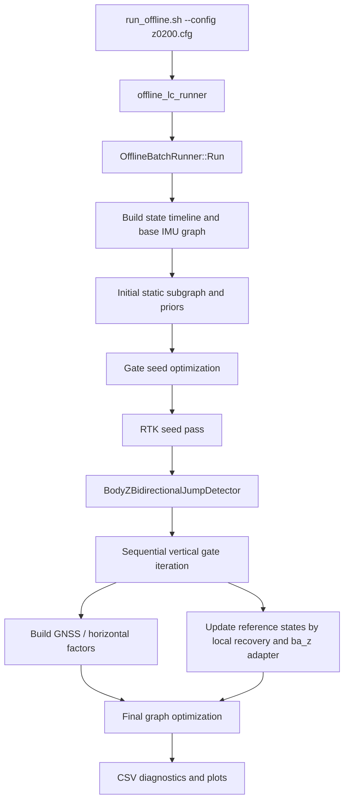

# Vertical Recovery Current Framework Notes

This document records the current vertical RTK/local-recovery framework as of commit
`19337b1 Plot vertical bias in full body-z window figure`, with the previous experiment
commit `e1711d2 Run zero-bias stress recovery experiment` still active in the code/config.

The current state is an experimental stress case, not a validated navigation solution.
It was intentionally configured to test whether a very wide vertical accelerometer bias
can replace local velocity/position recovery. The result is negative.

## How To Run The Current Case

Primary command:

```bash
cd /mnt/d/Code/offline_lc_minimal
cmake --build build -j4
ctest --test-dir build --output-on-failure
./run_offline.sh --config config/transformed1cut1_vertical_rtk_preintegration_feedback_z0200.cfg
```

Main output directory:

```text
runs/transformed1cut1_vertical_rtk_preintegration_feedback_z0200
```

Important generated diagnostics:

```text
gnss_consistency.csv
vertical_state_corrections.csv
vertical_local_recovery_iterations.csv
reference_node_trajectory.csv
body_z_seed_jump_windows.csv
summary.txt
current_full_local_body_z_windows.fig/.png
current_full_local_body_z_windows_first30s.fig/.png
current_postfit_body_z_windows.fig/.png
```

The full diagnostic plot script currently committed for reproducibility is:

```text
runs/transformed1cut1_vertical_rtk_preintegration_feedback_z0200/make_current_full_body_z_windows_fig.m
```

`runs/` is normally ignored by git, but this script was force-added because it contains
the latest four-panel plotting layout.

## Key Files And Responsibilities

```text
src/core/OfflineBatchRunner.cpp
```

Top-level orchestration. It builds the factor graph, runs seed/reference passes, applies
the sequential vertical gate/local recovery logic, writes diagnostics, and finally runs
the optimizer.

```text
src/core/VerticalLocalRecoveryUtils.cpp
include/offline_lc_minimal/core/VerticalLocalRecoveryUtils.h
```

Body-z window correction and local vertical recovery helpers. The current experiment
forces `BODY_Z_SEED_WINDOW` tail velocity to equal the pre-window velocity and disables
tail position micro-adjustment.

```text
src/core/VerticalInsideBiasAdapter.cpp
include/offline_lc_minimal/core/VerticalInsideBiasAdapter.h
```

Kalman-style low-frequency vertical bias adapter. It observes vertical residuals and
updates reference `ba_z`. In the current experiment it is allowed to accept bounded
outside-gate residuals.

```text
src/core/BodyZBidirectionalJumpDetector.cpp
include/offline_lc_minimal/core/BodyZBidirectionalJumpDetector.h
```

Uses the RTK seed pass attitude/bias and raw IMU to detect body-z acceleration jump
windows.

```text
include/offline_lc_minimal/factor/VerticalInsideKinematicFactor.h
```

Inside-stage factor constraining optimized `roll/pitch`, `vz`, and `ba_z` to the current
reference state. It does not constrain `pose.z` directly to RTK.

```text
include/offline_lc_minimal/factor/VerticalAccelBiasGmTransitionFactor.h
```

Vertical accelerometer bias Gauss-Markov process factor.

## Current z0200 Configuration State

Current critical config values:

```text
enable_vertical_rtk_preintegration_feedback = true
enable_vertical_acc_bias_gm_process = true
vertical_acc_bias_tau_s = 100.0
vertical_acc_bias_sigma_mps2 = 0.1
vertical_acc_bias_process_noise_scale = 1.0

enable_vertical_inside_bias_adaptation = true
vertical_inside_attitude_gain = 0.0
vertical_inside_max_delta_attitude_rad = 1e-4

enable_vertical_rtk_seed_pass = true
enable_body_z_seed_jump_windows = true

vertical_interval_feedback_max_delta_vz_mps = 0.02
enable_vertical_local_up_anchor_fallback = false

gnss_vertical_fixed_sigma_m = 0.05
gnss_nis_confidence = 0.95
```

Important: `vertical_acc_bias_sigma_mps2 = 0.1` is the stress-test setting. It is about
`10197 ug`, far above the original intended `10 ug` scale
(`9.80665e-5 m/s^2`). It was deliberately made extreme to test whether `ba_z` could
absorb vertical drift.

Current hard-coded body-z experiment behavior in `VerticalLocalRecoveryUtils.cpp`:

```text
kBodyZSeedTailVelocityMicroFeedbackLimitMps = 0.0
kBodyZSeedTailPositionMicroFeedbackLimitM = 0.0
BODY_Z_SEED_WINDOW target_tail_vz_mps = previous_vz_mps
BODY_Z_SEED_WINDOW target_tail_up_m = integrated_tail_up_m
```

This means a body-z window discards abnormal IMU inside the window, but it does not
allow tail velocity micro-feedback or tail height micro-feedback.

## Current Call Flow

High-level flow:



More detailed vertical path:

1. Initial static alignment is included in the graph.
2. A gate seed optimization builds initial reference states.
3. A separate RTK seed pass is used only to provide pose/velocity/bias reference for
   body-z jump detection.
4. `BodyZBidirectionalJumpDetector` detects body-z acceleration jump windows using seed
   attitude, seed `ba_z`, and raw IMU.
5. Main sequential vertical pass processes RTKFIX GNSS samples.
6. Dynamic-start vertical position is anchored once.
7. After dynamic start, vertical RTK pose factors are not added point-by-point.
8. Horizontal GNSS factors are still added.
9. `VerticalInsideKinematicFactor` constrains optimized `roll/pitch/vz/ba_z` to the
   current reference state.
10. Reference states are propagated sequentially by IMU and modified by local recovery
    and the inside bias adapter.
11. The final optimizer optimizes against this graph and these reference-based inside
    factors.

## What A Normal Global Factor Graph Would Do

A normal tightly coupled vertical RTK/IMU factor graph suppresses this kind of divergence
through full vertical closure:

1. RTK height factor directly constrains `pose.z`.
2. IMU preintegration constrains adjacent `pose`, `velocity`, and `bias`.
3. `ba_z` is bounded by a bias prior/process model, for example `10 ug` with `tau=100 s`.
4. The optimizer sees all residuals simultaneously and cannot easily explain a local
   velocity/height event as a huge sustained accelerometer bias.
5. If an IMU pulse is inconsistent with RTK, the graph exposes this as a local model
   inconsistency instead of allowing long-term height drift.

## How The Current Framework Differs

The current vertical scheme intentionally removed the direct dynamic vertical RTK pose
closure after the dynamic start. This was done to avoid pointwise RTK following.

Consequences:

1. Dynamic `pose.z` is not directly constrained by RTK except at the initial vertical
   anchor.
2. The trajectory is mainly a sequential reference trajectory plus horizontal GNSS and
   inside kinematic factors.
3. `VerticalInsideKinematicFactor` follows the reference state; it does not recover a bad
   reference height by itself.
4. If the reference trajectory receives an incorrect `ba_z`, later IMU propagation carries
   this error forward.
5. When `ba_z` sigma is made extremely wide, the system can interpret position/velocity
   mismatch as huge vertical accelerometer bias.

In short, the current framework breaks the normal vertical closed-loop mechanism and
turns much of the vertical correction into a sequential reference-state problem.

## Current Experimental Result

Latest stress experiment:

1. Tail velocity micro-feedback disabled.
2. Tail height micro-feedback disabled.
3. `vertical_acc_bias_sigma_mps2` widened to `0.1 m/s^2`.
4. `vertical_inside_attitude_gain` set to `0`.

Observed result:

```text
valid RTKFIX diagnostic samples: 904
outside 1D gate samples: 841
max absolute vertical residual: about 1658.6 m
p95 absolute vertical residual: about 1424.2 m
reference_baz range relative to start: about -9627 ug to +27863 ug
optimized_baz range relative to start: about -858 ug to +20252 ug
```

This shows that using very wide `ba_z` to absorb vertical residuals is not physically
reasonable. A required bias on the order of `10^4 ug` is far beyond the intended IMU bias
model and creates strong velocity ramps and height divergence.

## Why The 50 s Divergence Happens

In the current experiment, around 45-48 s after dynamic start:

1. Vertical residuals are already outside the 1D gate but still within the adapter's
   temporary `10 * gate` acceptance band.
2. The inside bias adapter accepts these residuals as `ba_z` observations.
3. Because `vertical_acc_bias_sigma_mps2 = 0.1`, the Kalman update can generate very large
   `ba_z` steps.
4. `reference_baz` rises to tens of thousands of `ug`.
5. This huge `ba_z` enters subsequent IMU propagation.
6. The propagated vertical velocity turns strongly negative.
7. Height diverges downward.

Representative values observed near 45-48 s:

```text
45.794 s: inside_bias_delta_baz_applied_mps2 about +0.0217 m/s^2, about +2208 ug
47.995 s: reference_baz about +0.2676 m/s^2, about +27292 ug
```

Once residuals exceed `10 * gate`, the adapter stops accepting further observations, but
the large `ba_z` has already contaminated the reference trajectory.

## Main Problems To Address Next

1. Direct vertical RTK closure was removed too aggressively.
   The system needs a way to remain RTK-consistent without pointwise height following.

2. `ba_z` is being used to explain errors that are not low-frequency accelerometer bias.
   A `10 ug, tau=100 s` bias process cannot repair short-window velocity events.

3. Body-z window handling must decide what to do at the window tail.
   If tail velocity and height are both fixed to pre-window continuation, later height
   can drift. If they are too free, the algorithm creates artificial velocity/height
   jumps.

4. The reference trajectory is not a passive diagnostic; it becomes a target through
   `VerticalInsideKinematicFactor`.
   A bad reference state can pull the optimized state into a bad solution.

5. The current `10 * gate` outside residual acceptance in `VerticalInsideBiasAdapter` is
   useful for stress testing but unsafe as a final policy.

6. There is no robust separation between:
   - real IMU pulse/window errors,
   - slow accelerometer bias,
   - initial or window-tail height offset,
   - RTK noise/drift.

## Recommended Research Direction

Near-term experiments should avoid extreme `ba_z` freedom and restore a limited form of
vertical closure:

1. Restore `vertical_acc_bias_sigma_mps2` to the intended physical scale:

```text
vertical_acc_bias_sigma_mps2 = 9.80665e-5
```

2. Keep `ba_z` adaptation inside-gate or near-gate only, with strict innovation and
   smoothness checks.

3. Treat body-z pulse windows as local velocity/height uncertainty events, not as bias
   observations.

4. Add a weak, robust vertical consistency factor that penalizes long-term height drift
   without forcing pointwise RTK tracking.

5. Consider a window-level variable model:
   - one tail velocity correction,
   - one tail height offset,
   - strong smoothness/size priors,
   - evaluated over the interval until the next body-z window.

6. Keep `pose.z` consistency tied to RTK over a window or segment, not at every sample.
   The objective should be "residual remains stable and inside gate" rather than
   "endpoint residual is zero".

## New Conversation Starting Point

If this document is used to start a new discussion, the critical current conclusion is:

The present stress experiment proves that large `ba_z` is not a valid substitute for
body-z window velocity/height recovery. The normal factor graph suppresses vertical
divergence through RTK height closure plus bounded bias dynamics, but the current
sequential reference framework removed the direct dynamic vertical closure and therefore
can amplify wrong reference-state updates into long-term height drift.

